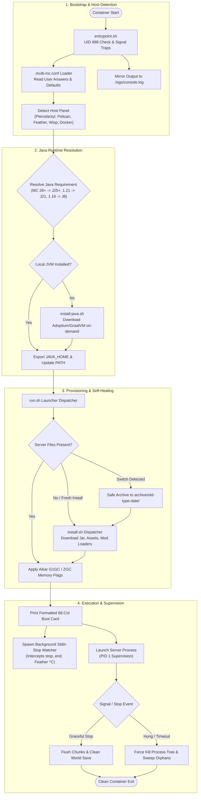

<!-- markdownlint-disable -->
<div align="center">


[](https://github.com/PotenFYR-Studios/Minecraft-Eggs)

<p align="center">
  <a href="https://potenfyr.in"></a>
  <a href="https://discord.com/invite/zUaN2FPBec"></a>
  <a href="https://modrinth.com/organization/potenfyr"></a>
  <a href="mailto:support@potenfyr.in"></a>
  <a href="https://github.com/PotenFYR-Studios/Minecraft-Eggs"></a>
</p>

[](https://github.com/PotenFYR-Studios/Minecraft-Eggs/actions/workflows/docker-image.yml)
[](https://github.com/PotenFYR-Studios/Minecraft-Eggs#-supported-server-software--engine-matrix)
[](https://github.com/PotenFYR-Studios/Minecraft-Eggs#-java-runtime-guide--on-demand-engine)
[](https://github.com/PotenFYR-Studios/Minecraft-Eggs/pkgs/container/minecraft-eggs)
[](LICENSE)
[](https://github.com/PotenFYR-Studios/Minecraft-Eggs#-architecture--os-platform-support)
[](https://github.com/PotenFYR-Studios/Minecraft-Eggs#-panel-compatibility--detection)

<p align="center">
  <b>One universal egg. One Docker image. Every Minecraft server. Every version. Any panel. Any architecture.</b><br>
  Instant switching across 19 server families, on-demand Java 8–25+ auto-provisioning, Aikar's tuned GC memory allocation, intelligent console wizard, non-destructive instance archiving, and rock-solid panel stop handlers.
</p>

<p align="center">
  <a href="#-highlights--core-philosophy">Highlights</a> •
  <a href="#-quick-start-in-5-minutes">Quick Start</a> •
  <a href="#-architecture--lifecycle-flow">Architecture</a> •
  <a href="#-supported-server-software--engine-matrix">Supported Software</a> •
  <a href="#-egg-variable-reference">Variables</a> •
  <a href="#-examples-cookbook">Cookbook</a> •
  <a href="#-java-runtime-guide--on-demand-engine">Java Guide</a> •
  <a href="#-safe-instance-switching--archiving">Safe Archiving</a> •
  <a href="#-troubleshooting--diagnostics">Troubleshooting</a> •
  <a href="#-activity-star-history--metrics">Live Graphs</a>
</p>

---

</div>

## 📑 Contents

<details open>
<summary><b>Click to expand / collapse contents</b></summary>

- [✨ Highlights & Core Philosophy](#-highlights--core-philosophy)
- [🚀 Quick Start in 5 Minutes](#-quick-start-in-5-minutes)
- [🧩 Architecture & Lifecycle Flow](#-architecture--lifecycle-flow)
- [🎮 Supported Server Software & Engine Matrix](#-supported-server-software--engine-matrix)
  - [Engine Category Directory](#engine-category-directory-19-supported-server-families)
  - [Full Engine Matrix](#full-engine-matrix-ports-defaults--highlights)
- [🧙 The Interactive Console Wizard](#-the-interactive-console-wizard)
- [⚙️ Egg Variable Reference](#️-egg-variable-reference)
  - [Choosing the Software](#choosing-the-software)
  - [Java & Performance Tuning](#java--performance-tuning)
  - [Fresh Server Properties Defaults](#fresh-serverproperties-defaults)
  - [Content, Maintenance & Updates](#content-maintenance--updates)
  - [Stop Behavior & Console Theme](#stop-behavior--console-theme)
- [🍳 Examples Cookbook](#-examples-cookbook)
- [🔄 Safe Instance Switching & Archiving](#-safe-instance-switching--archiving)
- [☕ Java Runtime Guide & On-Demand Engine](#-java-runtime-guide--on-demand-engine)
- [⚡ Performance Tuning & Garbage Collection](#-performance-tuning--garbage-collection)
- [🛡️ Security Model & Hardening](#️-security-model--hardening)
- [🛑 Panel Stop Watcher & Signal Handling](#-panel-stop-watcher--signal-handling)
- [💻 Architecture & OS Platform Support](#-architecture--os-platform-support)
- [🖥️ Panel Compatibility & Detection](#️-panel-compatibility--detection)
- [🔧 Troubleshooting & Diagnostics](#-troubleshooting--diagnostics)
- [🧪 Testing Suite & CI/CD](#-testing-suite--cicd)
- [📂 Repository Structure](#-repository-structure)
- [📈 Activity, Star History & Metrics](#-activity-star-history--metrics)
- [🤝 Community & Contributing](#-community--contributing)
- [📜 License](#-license)

</details>

---

## ✨ Highlights & Core Philosophy

<table>
  <tr>
    <td width="50%">
      <h3>🎯 Single Universal Egg</h3>
      <p>Deploy, manage, and switch every Minecraft server family across Pterodactyl, Pelican, Feather, Wisp, and Docker using one unified egg and container image. Never juggle dozens of outdated single-purpose eggs again.</p>
    </td>
    <td width="50%">
      <h3>☕ Intelligent Auto-Java Matrix</h3>
      <p>Seamlessly pairs Minecraft releases (Alpha to 26.x) with the exact JVM required (Java 8 through 25+). Missing runtimes are resolved and downloaded on-demand inside the container without rebuilding the Docker image.</p>
    </td>
  </tr>
  <tr>
    <td width="50%">
      <h3>🛡️ Safe Non-Destructive Archiving</h3>
      <p>Switching server software (e.g. Vanilla to Paper) or jumping major Minecraft versions never wipes your files. Previous worlds, plugins, and configs are archived to <code>archive/</code> while the new instance installs clean.</p>
    </td>
    <td width="50%">
      <h3>⚡ Hardware-Aware Performance Tuning</h3>
      <p>Pre-configured with industry-standard <b>Aikar's tuned G1GC flags</b> and low-pause ZGC modes. Memory limits (<code>SERVER_MEMORY</code>) dynamically size heap and GC threads with AlwaysPreTouch safeguards.</p>
    </td>
  </tr>
</table>

---

## 🚀 Quick Start in 5 Minutes


1. **Download the Egg**: Get [`egg-minecraft-multi.json`](egg-minecraft-multi.json).
2. **Import into Your Panel**:
   - **Pterodactyl / Jexactyl**: *Admin -> Nests -> Select or Create 'Minecraft' Nest -> Import Egg*
   - **Pelican**: *Admin -> Eggs -> Upload Egg*
   - **Feather / Wisp / Docker**: Fully compatible with Wings and Pterodactyl v2 egg specifications.
3. **Create Server**:
   - Nest: `Minecraft`
   - Egg: `Multi Minecraft`
   - Container Image: `ghcr.io/potenfyr-studios/minecraft-eggs:latest`
   - Memory: `2048 MB` minimum (recommended `4096 MB+` for Paper/Purpur, `6144 MB+` for modpacks).
   - Port Allocation: `25565` (or `19132` for Bedrock).
4. **Set Startup Variables**:
   - `SERVER_TYPE`: e.g. `paper`, `purpur`, `vanilla`, `fabric`, `neoforge`, `velocity`
   - `MINECRAFT_VERSION`: e.g. `latest`, `1.21.4`, `1.20.1`, `1.16.5`, `1.12.2`
5. **Start Your Server**:
   On first boot, the runtime validates inputs, auto-provisions the matching Java runtime, applies tuned flags, generates fresh configs, and prints the interactive boot card:

```text
 ┌──────────────────────────────────────────────────────────────────┐
 │  ◆ Server Type     : paper                                      │
 │  ◆ MC Version      : 1.21.4                                     │
 │  ◆ Java Runtime    : OpenJDK 21.0.6 (Adoptium)                  │
 │  ◆ Entry Point     : java -jar server.jar                       │
 │  ◆ Target Jarfile  : server.jar                                 │
 │  ◆ GC Tuning       : Aikar G1GC Flags (Optimized)               │
 │  ◆ Memory Tuning   : 4096MB Xmx (safe heap 3481MB)              │
 │  ◆ Disk Free       : 42G available                              │
 │  ◆ Port Allocation : 25565 (0.0.0.0)                            │
 │  ◆ Host Platform   : Pterodactyl / Wings v1.11                  │
 │  ◆ Server UUID     : 3a9c7621-e0f4-4d2b-9e8c-8f1e9c20a114       │
 │  ◆ Egg Self-Update : Enabled                                    │
 │  ◆ Reinstall Mode  : Always update on reinstall                 │
 │  ◆ Stop Watcher    : Enabled (Graceful Console/Signal)          │
 │  ◆ Process User    : container (uid 988)                        │
 │  ◆ Architecture    : x86_64 (Linux)                             │
 │  ◆ Working Dir     : /home/container                            │
 └──────────────────────────────────────────────────────────────────┘
```

> [!NOTE]
> Accept the Minecraft **EULA** checkbox when prompted in your panel. When server files are fresh or missing, the launcher self-heals by triggering the provisioning installer automatically.

---

## 🧩 Architecture & Lifecycle Flow



---

## 🎮 Supported Server Software & Engine Matrix

<div align="center">

<p align="center">
  
  
  
  
  
  
  
  
  
  
  
  
  
  
</p>

### Engine Category Directory (19+ Supported Server Families)

| Category | Supported Software & Dispatched `SERVER_TYPE` Values |
| :--- | :--- |
| **High-Performance & Plugins** | `paper` `purpur` `folia` `spigot` `vanilla` |
| **Modded & Hybrid Loaders** | `fabric` `neoforge` `forge` `quilt` `mohist` `magma` |
| **Proxy Networks & Gateways** | `velocity` `bungeecord` `waterfall` |
| **Bedrock & Mobile Editions** | `bedrock` `pocketmine` `nukkit` |
| **Custom & Direct Integrations**| `github` (Direct GitHub Release jars) `custom` (Bring-Your-Own-Files & scripts) |

</div>

### Full Engine Matrix (Ports, Defaults & Highlights)

<details open>
<summary><b>🔍 Expand Full 19+ Engine Matrix</b></summary>

<br>

| Engine | `SERVER_TYPE` | Supported Versions | Default Port | Java / Runtime | Key Features & Highlights |
| :--- | :--- | :--- | :--- | :--- | :--- |
| **Paper** | `paper` | `1.7` to `26.x`, all builds | `25565` | Auto (8 - 25+) | High-performance, anti-xray, rich Paper plugin API, build pinning via `BUILD_NUMBER` |
| **Purpur** | `purpur` | `1.14` to `26.x`, all builds | `25565` | Auto (8 - 25+) | Feature-packed Paper fork with configurable gameplay mechanics and performance knobs |
| **Folia** | `folia` | `1.19` to `26.x`, all builds | `25565` | Auto (17 - 25+) | Multi-threaded regionised tick loop for high-population servers (PaperMC upstream) |
| **Spigot** | `spigot` | `1.8` to `26.x` | `25565` | Auto (8 - 25+) | Classic Bukkit/Spigot runtime with automated container-side BuildTools compilation |
| **Mojang Vanilla** | `vanilla` | Alpha to `26.x` + snapshots | `25565` | Auto (8 - 25+) | Official vanilla server jar directly from Mojang Version Manifest (snapshots supported) |
| **Fabric** | `fabric` | `1.14` to `26.x`, all loaders | `25565` | Auto (8 - 25+) | Ultra-lightweight modular mod loader with automated Fabric meta installer & loader pinning |
| **NeoForge** | `neoforge` | `1.20.1` to `26.x`, all loaders | `25565` | Auto (17 - 25+) | Modern fork of Forge; automated installer run, `@unix_args.txt` execution handler |
| **Minecraft Forge**| `forge` | `1.1` to `26.x`, all loaders | `25565` | Auto (8 - 25+) | Classic mod loader; automatic Java 8 selection for 1.12.2/1.7.10, auto-run jar/args |
| **Quilt** | `quilt` | `1.14` to `26.x`, all loaders | `25565` | Auto (8 - 25+) | Community-driven open mod loader with Fabric backward compatibility |
| **Mohist** | `mohist` | `1.7.10`, `1.12.2`, `1.16.5`, `1.20.1` | `25565` | Auto (8 - 17) | Forge + Bukkit/Spigot hybrid server allowing forge mods and bukkit plugins simultaneously |
| **Magma** | `magma` | `1.12.2`, `1.16.5`, `1.20.1` | `25565` | Auto (8 - 17) | Open-source Forge & Spigot hybrid server jar |
| **Velocity** | `velocity` | `1.x` to `4.x`, all builds | `25577` | Java 21 | Next-generation modern proxy with packet encryption and forwarding (`velocity.toml` auto-patch) |
| **BungeeCord** | `bungeecord` | Always newest upstream | `25577` | Java 21 | Classic proxy server connecting multiple backend Minecraft instances; auto `stop` -> `end` |
| **Waterfall** | `waterfall` | `1.7` to `1.20`, all builds | `25577` | Java 21 | PaperMC's upgraded BungeeCord fork with improved networking and stability |
| **Bedrock (BDS)** | `bedrock` | Every official release | `19132` | Native (x86_64) | Official Mojang Bedrock Dedicated Server; runs native ELF binary without Java overhead |
| **PocketMine-MP** | `pocketmine` | Always newest upstream | `19132` | PHP 8.x | High-performance Bedrock server written in PHP with rich plugin ecosystem |
| **Nukkit** | `nukkit` | Always newest upstream | `19132` | Java 21 | High-throughput Java implementation for Minecraft: Bedrock Edition |
| **GitHub Releases**| `github` | Any release or tag | `25565` | Auto / Specified | Install directly from any GitHub repo (`owner/repo`) with release asset auto-discovery |
| **Custom Engine** | `custom` | Bring Your Own Jar / Script | Configurable | Any | Executes custom startup command (`CUSTOM_COMMAND`) or server-provided `run.custom.sh` |

</details>

---

## 🧙 The Interactive Console Wizard

If a required setting is missing or contains a typo, the egg never fails silently. An interactive console wizard steps in directly inside the panel log:

```text
container@pterodactyl~ [warn] Server type 'banana' is not supported by this egg.
? Select a server type [default: vanilla, 120s timeout]: paper
container@pterodactyl~ Saved server type 'paper' in .multi-mc.conf (delete this file to reset)
```

- **Smart Defaults & Persistence**: Choices are saved to `/home/container/.multi-mc.conf` (`chmod 600`), so subsequent restarts boot immediately.
- **Panel Precedence**: Real panel startup variables always take priority over stored wizard answers.
- **Fail-Safe Timeout**: Prompts timeout automatically after 120 seconds, preventing hung startups on automated or unattended node boots.

---

## ⚙️ Egg Variable Reference

The egg provides 28 variables divided into customer-facing (USER) and node-administrator (ADMIN) controls.

### Choosing the Software

| Variable | Default | Who | Description |
| :--- | :--- | :---: | :--- |
| `SERVER_TYPE` | `vanilla` | USER | Software engine to install (e.g. `paper`, `purpur`, `fabric`, `neoforge`, `bedrock`) |
| `MINECRAFT_VERSION` | `latest` | USER | Release number or channel: `latest`, `stable`, `1.21.4`, `1.12.2`, `snapshot`, `preview` |
| `BUILD_NUMBER` | `latest` | USER | Build number for Paper, Folia, Purpur, Velocity, Waterfall, or Mohist |
| `LOADER_VERSION` | `latest` | USER | Mod loader version for Forge, NeoForge, Fabric, or Quilt |
| `GITHUB_REPO` | *(empty)* | USER | `owner/repo` (or GitHub URL) when `SERVER_TYPE=github` |
| `GITHUB_TAG` | `latest` | USER | Specific release tag for GitHub-sourced installations |
| `GITHUB_ASSET` | *(empty)* | USER | Asset filename substring filter (empty auto-picks the server jar) |
| `GITHUB_TOKEN` | *(empty)* | USER | Optional GitHub Personal Access Token for private repos or rate-limit immunity |
| `SERVER_JARFILE` | `server.jar` | USER | Target jar name (automatically managed for modern Forge/NeoForge `unix_args.txt`) |
| `CUSTOM_COMMAND` | `java -Xmx1024M -jar server.jar` | USER | Execution command used when `SERVER_TYPE=custom` |

### Java & Performance Tuning

| Variable | Default | Who | Description |
| :--- | :--- | :---: | :--- |
| `JAVA_VERSION` | *(auto)* | USER | Explicit JVM override: `8`, `11`, `17`, `21`, `25`, `graalvm-21`, `corretto-21`, `semeru-21` |
| `JAVA_FLAGS` | Aikar G1GC | USER | Full JVM argument string. Clear to let `GC_TYPE` decide; pass single space to disable |
| `GC_TYPE` | `auto` | USER | Garbage collector mode: `auto` (Aikar G1GC), `zgc` (Java 21+ low-pause), `parallel` |
| `EXTRA_ARGS` | *(empty)* | USER | Arguments appended directly after the server jar (e.g. `--nogui`) |

### Fresh `server.properties` Defaults

Applied only when the installer provisions a brand-new server. They **never** overwrite files you have edited.

| Variable | Default | Who | Description |
| :--- | :--- | :---: | :--- |
| `MOTD` | `A Minecraft Server` | USER | Message of the Day shown in client multiplayer lists |
| `MAX_PLAYERS` | `20` | USER | Maximum concurrent player slot count |
| `ONLINE_MODE` | `true` | USER | Validate player sessions against Mojang session servers |
| `VIEW_DISTANCE` | `10` | USER | Server-side chunk render and ticking distance |
| `DIFFICULTY` | *(empty)* | USER | World difficulty: `peaceful`, `easy`, `normal`, `hard` |
| `GAMEMODE` | *(empty)* | USER | Default player gamemode: `survival`, `creative`, `adventure`, `spectator` |
| `PVP` | `true` | USER | Allow player versus player combat damage |
| `RCON_PASSWORD` | *(empty)* | USER | Enables server RCON when set (persisted securely in properties) |

### Content, Maintenance & Updates

| Variable | Default | Who | Description |
| :--- | :--- | :---: | :--- |
| `AUTO_UPDATE` | `1` | USER | `1` refreshes the jar on reinstall; `0` keeps existing files intact |
| `KEEP_BACKUP` | `0` | USER | `1` archives previous server jar to `<name>.old` before replacing |
| `WORLD_URL` | *(empty)* | ADMIN | URL to a world zip archive automatically unpacked into `./world` |
| `EXTRA_URLS` | *(empty)* | ADMIN | Multi-line list of companion downloads formatted as `[subdir/]|url` |
| `SHOW_VERSIONS` | `0` | ADMIN | `1` prints all upstream versions on reinstall without modifying server files |
| `DL_URL` | *(empty)* | ADMIN | Direct download link that overrides project version resolution logic |
| `DEBUG` | `0` | ADMIN | `1` enables verbose trace logging across installer and launcher scripts |

### Stop Behavior & Console Theme

| Variable | Default | Who | Description |
| :--- | :--- | :---: | :--- |
| `PANEL_STOP_WATCHER`| `auto` | USER | `auto`/`1` activates stdin watcher for stop text (`stop`, `end`, `^C`); `0` passes stdin raw |
| `CLI_THEME` | `prog` | USER | `prog` (PotenFYR gradient banner and boot card); `classic` (yolk-style logs) |
| `CLI_BANNER_GRADIENT`| `auto` | USER | Console gradient theme: `auto`, `citrus`, `aurora`, `sunset`, `ocean`, `candy` |

---

## 🍳 Examples Cookbook

### 1. Modern High-Performance Paper 1.21.4
```text
SERVER_TYPE       paper
MINECRAFT_VERSION 1.21.4
BUILD_NUMBER      latest
```

### 2. Crossplay in One Click (Paper + Geyser + Floodgate + ViaVersion)
```text
SERVER_TYPE       paper
MINECRAFT_VERSION latest
EXTRA_URLS        plugins|https://download.geysermc.org/v2/projects/geyser/versions/latest/builds/latest/downloads/geyser
                  plugins|https://download.geysermc.org/v2/projects/floodgate/versions/latest/builds/latest/downloads/floodgate
                  plugins|https://github.com/ViaVersion/ViaVersion/releases/latest/download/ViaVersion.jar
```
*(Remember to allocate an additional UDP port `19132` in your panel for Bedrock clients).*

### 3. Legacy Modpack (Forge 1.12.2 or 1.7.10)
```text
SERVER_TYPE       forge
MINECRAFT_VERSION 1.12.2
LOADER_VERSION    latest
```
*Java 8 is selected automatically. Modern Forge / NeoForge (1.17+) auto-executes through `@unix_args.txt`.*

### 4. Modern NeoForge 1.21.x Server
```text
SERVER_TYPE       neoforge
MINECRAFT_VERSION 1.21.1
LOADER_VERSION    latest
```

### 5. High-Throughput Proxy Network (Velocity)
```text
SERVER_TYPE       velocity
MINECRAFT_VERSION latest
```
*`velocity.toml` is created automatically and its bind address is patched to your panel's allocated port. Clicking Stop safely sends `end`.*

### 6. Official Bedrock Dedicated Server (BDS)
```text
SERVER_TYPE       bedrock
MINECRAFT_VERSION latest
```
*Executes native BDS binary on port `19132` (x86_64 host node).*

### 7. Custom GitHub Release Server (Arclight, Purpur Forks, etc.)
```text
SERVER_TYPE       github
GITHUB_REPO       IzzelAliz/Arclight
GITHUB_TAG        latest
GITHUB_ASSET      1.20.4
```

### 8. Custom Engine with Own Startup Script
```text
SERVER_TYPE       custom
CUSTOM_COMMAND    java -Xmx4096M -jar custom-server.jar nogui
```

---

## 🔄 Safe Instance Switching & Archiving

Switching server software or jumping major Minecraft lines will **never delete your world or configs**:

```text
/home/container/
├── server.jar                        # Current active server jar
├── server.properties                 # Current config
├── world/                            # Active world data
└── archive/
    ├── vanilla-1.20.4-20260301-1200/ # Archived previous Vanilla server
    └── paper-1.20.6-20260305-1530/   # Archived previous Paper instance
```

- **Same-Line Updates** (`1.21.1` -> `1.21.4`): Refreshed in-place; worlds, configs, and plugins remain completely untouched.
- **Breaking Changes** (`vanilla` -> `paper`, or `1.20` -> `1.21`): The existing installation is cleanly **moved** to `archive/<old-type>-<old-version>-<timestamp>/`, and the new engine is installed fresh.
- **Full Transparency**: Archive locations are reported in the console. You can inspect or purge old archives from the File Manager at your leisure.

---

## ☕ Java Runtime Guide & On-Demand Engine

The container ships with multiple JVMs and dynamically resolves the required runtime based on the targeted Minecraft release:

| Minecraft Version | Auto-Selected Java | Engine Notes |
| :--- | :---: | :--- |
| **26.x and newer** | **Java 25+** | Future-proofed for modern and upcoming snapshot releases |
| **1.20.5 - 1.21.x** | **Java 21** | Standard LTS runtime for modern Minecraft |
| **1.17 - 1.20.4** | **Java 17** | Required for Caves & Cliffs through Trails & Tales |
| **1.16.5 and older** | **Java 8** | First-class legacy support for classic modpacks (1.12.2 / 1.7.10) |
| **Proxies / Nukkit** | **Java 21** | Velocity, BungeeCord, Waterfall, Nukkit |
| **Bedrock / PocketMine** | *None / PHP* | Bedrock BDS is native C++; PocketMine runs via PHP 8.x |

### Dynamic On-Demand Resolution
Need an exotic JVM or an unreleased Java version?
- Set `JAVA_VERSION=graalvm-21`, `corretto-21`, or `semeru-21`.
- Pass a direct tarball download link to `JAVA_URL`.
- The container downloads, verifies, and activates the runtime in `/home/container/.java/` **without requiring a Docker image rebuild**.

---

## ⚡ Performance Tuning & Garbage Collection

### Aikar's Tuned G1GC Flags (Default)
By default, the launcher injects the community-gold-standard **Aikar G1GC** parameters, tuned specifically for Minecraft:
```bash
-XX:+UseG1GC -XX:+ParallelRefProcEnabled -XX:MaxGCPauseMillis=200
-XX:+UnlockExperimentalVMOptions -XX:+DisableExplicitGC -XX:+AlwaysPreTouch
-XX:G1NewSizePercent=30 -XX:G1MaxNewSizePercent=40 -XX:G1ReservePercent=20
-XX:G1HeapWastePercent=5 -XX:G1MixedGCCountTarget=4
-XX:InitiatingHeapOccupancyPercent=15 -XX:G1MixedGCLiveThresholdPercent=90
-XX:G1RSetUpdatingPauseTimePercent=5 -XX:SurvivorRatio=32 -XX:+PerfDisableSharedMem
-XX:G1SATBBufferEnqueueingThresholdPercent=30 -XX:G1ConcMarkStepDurationMillis=5
```

### ZGC Ultra-Low Pause Mode
For high-memory dedicated servers (8 GB+ allocated RAM running Java 21+):
- Clear `JAVA_FLAGS`
- Set `GC_TYPE=zgc`
- Unlocks sub-millisecond GC pauses for massive player counts and modpacks.

---

## 🛡️ Security Model & Hardening

- **Rootless Container Execution**: Runs strictly under unprivileged Pterodactyl user `container` (`UID 988:988`). Never requires root privileges during runtime.
- **Read-Only Root Filesystem Compliance**: Conforms to Pterodactyl Wings security constraints. Data is written solely to `/home/container`.
- **Protected Core Scripts**: All orchestration scripts (`run.sh`, `entrypoint.sh`, `install.sh`, `install-java.sh`) reside in root-owned `/opt/potenfyr/`, completely inaccessible from the panel's File Manager jail.
- **Atomic Operations & Sanitization**: File downloads are staged atomically into temporary files before being moved to prevent corrupt partial jars. Path traversals in `EXTRA_URLS` are blocked, and input variables are strictly validated.
- **Zero Secret Leakage**: No hardcoded API keys or credentials. Sensitive environment details are masked from logs.

---

## 🛑 Panel Stop Watcher & Signal Handling

Traditional Minecraft server eggs frequently hang on **"Stopping..."** because panel daemons (such as Wings and Feather Panel) deliver the stop command as plain console text over container TTY `stdin` instead of raising real OS signals.

**How Multi Minecraft solves this:**
1. **Background Stdin Watcher**: A lightweight watcher scans standard input in real time. When it observes `stop`, `^C` (Feather Panel TTY interrupt), `end`, or `kill`, it intercepts the command and executes a graceful shutdown.
2. **Transparent Console Pass-Through**: All non-stop console lines (such as `/say`, `/whitelist`, `/op`) pass through directly to the Minecraft server without delay.
3. **Signal Trapping**: Intercepts SIGTERM and SIGINT from Docker and Kubernetes, allowing JVM shutdown hooks to save world chunks before container termination.
4. **Proxy Stop Translation**: Automatically translates `stop` to `end` for Velocity and BungeeCord servers.
5. **Hung Process Sweeping**: If a crashed or hung server fails to terminate within the grace window, the entire process tree is cleanly force-terminated, preventing orphaned zombie processes.

---

## 💻 Architecture & OS Platform Support

The container image is built on **Ubuntu 22.04 LTS (glibc)** and targets multi-architecture host platforms:

<div align="center">

| Architecture | Platform String | Runtime Status | Supported Software |
| :---: | :---: | :---: | :--- |
| **x86_64** | `linux/amd64` | **Tier 1 Verified** | All 19 engines (Java, Bedrock BDS, PHP) |
| **ARM64** | `linux/arm64` | **Tier 1 Verified** | All Java engines, Fabric, Forge, PocketMine |
| **POWER8/9** | `linux/ppc64le` | Supported | Java engines via Adoptium OpenJDK runtimes |
| **IBM Z** | `linux/s390x` | Supported | Java engines via Adoptium OpenJDK runtimes |
| **RISC-V** | `linux/riscv64` | Experimental | Distro OpenJDK fallback targets |

</div>

---

## 🖥️ Panel Compatibility & Detection

The egg conforms to the `PTDL_v2` egg specification and is auto-detected across hosting environments:

<div align="center">

| Panel / Orchestrator | Auto-Detected | Identification Fingerprint & Notes |
| :--- | :---: | :--- |
| **Pterodactyl 1.x** | Yes | Standard Wings `/home/container` mount and environment vars |
| **Pelican Panel** | Yes | Native PTDL_v2 import support, `P_SERVER_UUID` recognition |
| **Feather Panel** | Yes | Detected via `P_SERVER_UUID_SHORT`; stdin watcher catches `^C` text |
| **Wisp Panel** | Yes | Wisp daemon volume mappings and daemon stop tokens |
| **Jexactyl** | Yes | Direct drop-in support under standard Minecraft nests |
| **Docker / Compose** | Yes | Standalone container execution via environment variables |

</div>

---

## 🔧 Troubleshooting & Diagnostics

Whenever an issue occurs, detailed diagnostic dumps are recorded automatically:

| Log File | Purpose & Contents |
| :--- | :--- |
| `install-error.log` | Step-by-step trace of install executions with timestamps, functions, and commands |
| `.logs/launcher-errors.log`| Complete journal of boot events, exit codes, crash reports, OOMs, and Java versions |
| `.logs/console.log` | Mirrored console scrollback preserving logs even after panel buffers clear |

### Common Symptoms & Solutions

> [!WARNING]
> **UnsupportedClassVersionError**: The Minecraft version requires a newer Java runtime than currently active. Set `JAVA_VERSION` to empty (auto) or specify the matching version (e.g. `21`).

> [!TIP]
> **Server Unreachable on IP:Port**: Ensure the port allocated in your panel matches `SERVER_PORT`. Reinstall once if config files are missing so default port binds are written.

> [!NOTE]
> **Bedrock Server will not launch on ARM node**: Mojang only distributes official BDS binaries for x86_64 Linux. Use an x86_64 node or switch `SERVER_TYPE` to `nukkit` or `pocketmine`.

---

## 🧪 Testing Suite & CI/CD

Our testing harness replicates strict Pterodactyl Wings container parameters (`-u 988:988`, read-only root filesystems, memory quotas) and validates lifecycle shutdown, signal traps, and Java auto-resolution:

```bash
# Build test image locally
docker build -t mc-eggs-test -f tests/Dockerfile.test .

# Run the panel lifecycle test suite
bash tests/panel-test.sh
```

---

## 📂 Repository Structure

```text
Minecraft-Eggs/
├── egg-minecraft-multi.json       # Universal Pterodactyl / Pelican egg definition
├── Dockerfile                    # Multi-stage universal container image definition
├── entrypoint.sh                 # Container bootstrap, panel detection & secret init
├── run.sh                        # Universal launcher, wizard, diagnostics & supervisor
├── install.sh                    # Multi-server provisioning engine (embedded in egg)
├── install-java.sh               # On-demand multi-JVM resolution and downloader
├── tests/
│   ├── Dockerfile.test           # Isolated test harness container definition
│   └── panel-test.sh             # Panel behavior, signals & stdin stop test suite
└── .github/workflows/
    └── docker-image.yml          # Multi-arch GitHub Actions build & publish pipeline
```

---

## 📈 Activity, Star History & Metrics

<div align="center">

<p align="center">
  <a href="https://github.com/PotenFYR-Studios/Minecraft-Eggs/stargazers"></a>
  <a href="https://github.com/PotenFYR-Studios/Minecraft-Eggs/network/members"></a>
  <a href="https://github.com/PotenFYR-Studios/Minecraft-Eggs/issues"></a>
  <a href="https://github.com/PotenFYR-Studios/Minecraft-Eggs/pulls"></a>
  <a href="https://github.com/PotenFYR-Studios/Minecraft-Eggs/graphs/contributors"></a>
  <a href="https://github.com/PotenFYR-Studios/Minecraft-Eggs/commits/main"></a>
</p>

### 🌟 Real-time Star History

<picture>
  <source media="(prefers-color-scheme: dark)" srcset="https://api.star-history.com/svg?repos=PotenFYR-Studios/Minecraft-Eggs&type=Date&theme=dark">
  <source media="(prefers-color-scheme: light)" srcset="https://api.star-history.com/svg?repos=PotenFYR-Studios/Minecraft-Eggs&type=Date&theme=light">
  
</picture>

<sub>📈 Live graph rendered by <a href="https://star-history.com">star-history.com</a>. Updates in real-time as users star the repository.</sub>

</div>

---

## 🤝 Community & Contributing

We welcome contributions, bug reports, and server software suggestions!

- **Encountered an issue or missing feature?** [Open an issue](https://github.com/PotenFYR-Studios/Minecraft-Eggs/issues) on GitHub.
- **Want to improve scripts or test cases?** Submit a [Pull Request](https://github.com/PotenFYR-Studios/Minecraft-Eggs/pulls).
- **Need setup assistance?** Join our developer & hosting community on Discord!

<div align="center">

[](https://discord.com/invite/zUaN2FPBec)
[](https://discord.com/invite/PRJASTKqwD)
[](https://modrinth.com/organization/potenfyr)
[](https://potenfyr.in)

</div>

---

## 📜 License

This project is licensed under the [MIT License](LICENSE).

<div align="center">

<p><b>Crafted with passion by <a href="https://github.com/PotenFYR-Studios">PotenFYR Studios</a></b><br>
<i>Support & Inquiries: <a href="mailto:support@potenfyr.in">support@potenfyr.in</a></i></p>


</div>