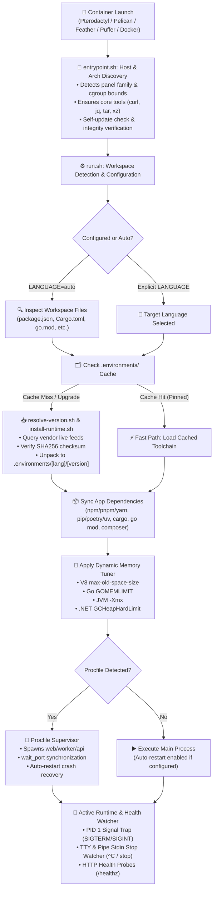
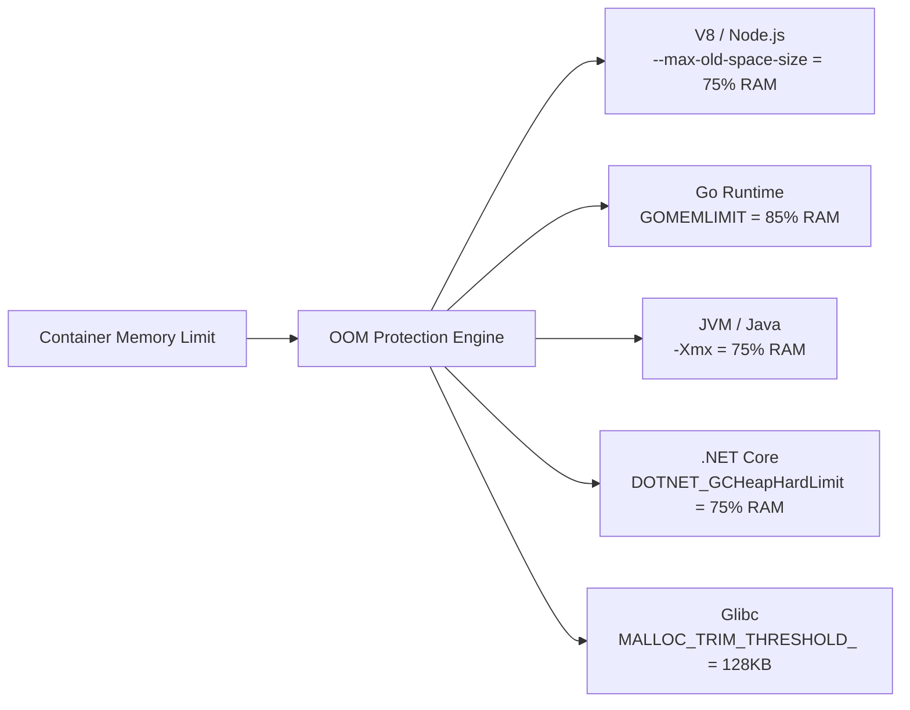

<div align="center">

<!-- HEADER BANNER -->


<!-- TYPING SVG SUBTITLE -->
<a href="https://github.com/PotenFYR-Studios/Prog-Language-Eggs">
  
</a>

<br/>

<!-- BADGES -->
<a href="https://potenfyr.in"></a>
<a href="https://discord.gg/potenfyr"></a>
<a href="mailto:support@potenfyr.in"></a>
<br/>
<a href="https://github.com/PotenFYR-Studios/Prog-Language-Eggs/actions"></a>
<a href="https://github.com/PotenFYR-Studios/Prog-Language-Eggs/pkgs/container/prog-language-eggs"></a>
<a href="#supported-languages-50"></a>
<a href="#multi-panel-support"></a>
<a href="#runs-anywhere-cpu--os"></a>
<a href="LICENSE"></a>

<br/>

<p align="center">
  <b>One egg. One image. Every language.</b><br/>
  A production-grade hosting runtime that automatically installs, updates, compiles, and supervises <b>50+ programming languages</b> inside your container — built natively for <b>Pterodactyl</b>, <b>Pelican</b>, <b>Feather Panel</b>, <b>PufferPanel</b>, <b>Jexactyl</b>, <b>Wisp</b>, <b>Emerald</b>, <b>Kubernetes</b>, and standalone <b>Docker</b>.
</p>

</div>

---

## ⚡ Feature Highlights

<table>
  <tr>
    <td width="50%" valign="top">
      <h3 align="left">🚀 Zero-Config Auto-Detection</h3>
      <ul>
        <li><b>Smart Workspace Inspection:</b> Scans repository files (<code>package.json</code>, <code>requirements.txt</code>, <code>Cargo.toml</code>, <code>go.mod</code>, <code>*.csproj</code>) and boots the exact stack.</li>
        <li><b>First-Boot Pinning:</b> Pinned versions lock in <code>.multi-prog.conf</code> for predictable cold starts, with instant <code>auto-detect</code> re-arming.</li>
        <li><b>Custom Command Overrides:</b> Full authority to override runner, entry point, build steps, or custom execution paths.</li>
      </ul>
    </td>
    <td width="50%" valign="top">
      <h3 align="left">📦 Dynamic On-Demand Toolchains</h3>
      <ul>
        <li><b>Live Upstream Feeds:</b> Resolves <code>latest</code>, <code>lts</code>, <code>stable</code>, <code>nightly</code>, or exact versions from official vendor APIs with checksum verification.</li>
        <li><b>Parallel Multi-Runtime Companion:</b> Install companion stacks (e.g. <code>EXTRA_RUNTIMES=python@3.12,bun@latest</code>) concurrently.</li>
        <li><b>Full Isolation & Preservation:</b> Separate major versions are preserved in <code>.environments/</code>; switching stacks never deletes previous work.</li>
      </ul>
    </td>
  </tr>
  <tr>
    <td width="50%" valign="top">
      <h3 align="left">🛡️ Dynamic Memory & OOM Protection</h3>
      <ul>
        <li><b>Unified Panel Limits:</b> Unifies Pterodactyl <code>SERVER_MEMORY</code>, Feather <code>FEATHER_MEMORY</code>, and cgroup ceilings automatically.</li>
        <li><b>Automatic Heap Calculation:</b> Computes safe runtime heap bounds (V8 <code>--max-old-space-size</code>, Go <code>GOMEMLIMIT</code>, JVM <code>-Xmx</code>, .NET <code>GCHeapHardLimit</code>).</li>
        <li><b>Glibc Malloc Trimming:</b> Reclaims unused memory aggressively to eliminate container crashes under peak loads.</li>
      </ul>
    </td>
    <td width="50%" valign="top">
      <h3 align="left">🔄 Native Procfile Multi-Service Supervisor</h3>
      <ul>
        <li><b>Procfile Support:</b> Orchestrate web servers, background workers, and APIs inside a single container instance.</li>
        <li><b>Sequential Dependency Ordering:</b> Built-in <code>wait_port &lt;host&gt; &lt;port&gt;</code> ensures databases or caches are reachable before API boot.</li>
        <li><b>Fault-Tolerant Auto-Recovery:</b> Exponential and linear crash backoffs, signal-relayed graceful drains, and per-process logs.</li>
      </ul>
    </td>
  </tr>
</table>

---

## 📑 Table of Contents

- [⚡ Feature Highlights](#-feature-highlights)
- [🏗️ System Architecture](#️-system-architecture)
- [🚀 Quick Start](#-quick-start)
  - [Pterodactyl / Pelican / Feather / PufferPanel](#1-game--hosting-panels)
  - [Plain Docker / Docker Compose](#2-plain-docker--docker-compose)
  - [Kubernetes / Cloud PAAS](#3-kubernetes--cloud-paas)
- [🌐 Supported Languages (50+)](#-supported-languages-50)
- [🖥️ Multi-Panel Compatibility](#️-multi-panel-compatibility)
- [💻 Hardware & Platform Support (Arch)](#-hardware--platform-support-arch)
- [⚙️ Language Selection & Keyword Channels](#️-language-selection--keyword-channels)
- [📁 Environment Isolation & Data Retention](#-environment-isolation--data-retention)
- [🎛️ Procfile Process Supervisor](#️-procfile-process-supervisor)
- [🛑 Panel Stop Watcher & Signal Handling](#-panel-stop-watcher--signal-handling)
- [🧠 Dynamic Memory Auto-Tuning Engine](#-dynamic-memory-auto-tuning-engine)
- [📋 Complete Startup Variables Reference](#-complete-startup-variables-reference)
- [🔒 Security & Hardening Posture](#-security--hardening-posture)
- [📂 Repository Layout](#-repository-layout)
- [🩺 Troubleshooting & Diagnostics](#-troubleshooting--diagnostics)
- [⭐ Star History](#-star-history)
- [📄 License & Credits](#-license--credits)

---

## 🏗️ System Architecture

The following diagram illustrates the boot lifecycle, environment detection, on-demand installation, memory tuning, and signal supervision:



---

## 🚀 Quick Start

### 1. Game & Hosting Panels
*Compatible with Pterodactyl, Pelican, Feather Panel, PufferPanel, Jexactyl, Wisp, and Emerald.*

1. **Download the Egg**: Get the latest [`egg-programming-multi.json`](https://github.com/PotenFYR-Studios/Prog-Language-Eggs/blob/main/egg-programming-multi.json).
2. **Import Template**:
   - In your panel admin area, navigate to **Nests / Templates** &rarr; **Import Egg**.
   - Select the downloaded `egg-programming-multi.json` and save.
3. **Create Server**:
   - Create a server using the imported egg.
   - Under Docker Image, ensure `ghcr.io/potenfyr-studios/prog-language-eggs:latest` is selected.
4. **Deploy**:
   - Upload your project files (or supply a `GIT_REPO`).
   - Leave `LANGUAGE=auto` or select your preferred language.
   - Click **Start**!

---

### 2. Plain Docker / Docker Compose

#### Standard Docker CLI:
```bash
docker run -d \
  --name my-app \
  -p 8080:8080 \
  -e SERVER_PORT=8080 \
  -e LANGUAGE=nodejs \
  -e RUNTIME_VERSION=lts \
  -v "$PWD/my-project:/home/container" \
  ghcr.io/potenfyr-studios/prog-language-eggs:latest
```

#### Docker Compose (`docker-compose.yml`):
```yaml
version: "3.8"
services:
  app:
    image: ghcr.io/potenfyr-studios/prog-language-eggs:latest
    container_name: multi-lang-service
    restart: unless-stopped
    ports:
      - "8080:8080"
    environment:
      - SERVER_PORT=8080
      - LANGUAGE=python
      - RUNTIME_VERSION=3.12
      - AUTO_INSTALL_DEPS=1
      - MEMORY_AUTO_TUNE=1
    volumes:
      - ./app:/home/container
```

---

### 3. Kubernetes / Cloud PAAS
The image natively detects Heroku-style dynos, Kubernetes pods, and cloud container environments:

```bash
# Railway / Render / Fly.io:
# Simply bind PORT and supply your project repo. Working directory and port bindings adapt automatically.
```

---

## 🌐 Supported Languages (50+)

The platform features an intelligent multi-ecosystem resolver with zero pre-baked bloat. Runtimes install on-demand, cache permanently in `.environments/`, and verify cryptographic signatures before execution.

<details open>
<summary><b>✨ View the Complete 54-Language Matrix</b></summary>
<br/>

| # | Language / Stack | Runners / Engines | Package Managers & Toolchains | Auto-Detect File Triggers |
|:---:|:---|:---|:---|:---|
| **1** | **Node.js (JavaScript)** | `node`, `nodemon`, `pm2` | `npm`, `pnpm`, `yarn` | `package.json`, `server.js`, `index.js`, `app.js` |
| **2** | **TypeScript** | `ts-node`, `tsx`, `bun`, `tsc` | `npm`, `pnpm`, `yarn`, `tsc` | `tsconfig.json`, `index.ts`, `server.ts` |
| **3** | **Bun** | `bun run`, `bun test`, `bunx` | `bun install` | `bun.lockb`, `bunfig.toml` |
| **4** | **Deno** | `deno run`, `deno task` | URL imports, `deno.json` | `deno.json`, `deno.jsonc`, `deno.lock` |
| **5** | **Python** | `python3`, `uvicorn`, `gunicorn` | `uv`, `pip`, `poetry`, `pipenv` | `requirements.txt`, `pyproject.toml`, `Pipfile`, `main.py` |
| **6** | **Java** | `java -jar`, `mvnw`, `gradlew` | `maven`, `gradle` | `pom.xml`, `build.gradle`, `build.gradle.kts`, `*.jar` |
| **7** | **Go** | `go run`, `./server` | `go mod` | `go.mod`, `go.sum`, `main.go` |
| **8** | **Rust** | `cargo run`, `./server` | `cargo` | `Cargo.toml`, `Cargo.lock`, `main.rs` |
| **9** | **C** | `gcc`, `clang`, `make` | `make`, `cmake`, `ninja` | `Makefile`, `CMakeLists.txt`, `main.c` |
| **10** | **C++** | `g++`, `clang++`, `make` | `make`, `cmake`, `ninja` | `CMakeLists.txt`, `main.cpp`, `main.cc` |
| **11** | **C# / .NET** | `dotnet run`, `dotnet exec` | `dotnet restore`, `nuget` | `*.csproj`, `*.sln`, `Program.cs` |
| **12** | **PHP** | `php -S`, `php artisan` | `composer` | `composer.json`, `index.php` |
| **13** | **Ruby** | `ruby`, `puma`, `bundle exec` | `gem`, `bundler` | `Gemfile`, `config.ru`, `app.rb` |
| **14** | **Static Website / SPA** | `serve`, `python http.server` | Static Web Assets | `index.html` |
| **15** | **Kotlin** | `kotlin`, `kotlinc`, `gradle` | `gradle`, `maven` | `build.gradle.kts`, `Main.kt` |
| **16** | **Scala** | `scala`, `sbt` | `sbt` | `build.sbt` |
| **17** | **Swift** | `swift run`, `swiftc` | `swift package` | `Package.swift`, `main.swift` |
| **18** | **Dart** | `dart run` | `dart pub` | `pubspec.yaml`, `main.dart` |
| **19** | **Zig** | `zig run`, `zig build` | `build.zig` | `build.zig`, `main.zig` |
| **20** | **Lua / LuaJIT** | `lua`, `luajit` | `luarocks` | `main.lua`, `rockspec` |
| **21** | **Elixir** | `mix run`, `elixir` | `mix`, `hex` | `mix.exs` |
| **22** | **Erlang** | `escript`, `rebar3` | `rebar3` | `rebar.config` |
| **23** | **Haskell** | `runghc`, `cabal`, `stack` | `cabal`, `stack` | `*.cabal`, `stack.yaml` |
| **24** | **Perl** | `perl` | `cpanm` | `cpanfile`, `main.pl` |
| **25** | **R** | `Rscript` | `install.packages()` | `main.R`, `description` |
| **26** | **Julia** | `julia` | `Pkg` | `Project.toml`, `main.jl` |
| **27** | **Clojure** | `lein run`, `clojure -M` | `leiningen`, `deps.edn` | `project.clj`, `deps.edn` |
| **28** | **Groovy** | `groovy`, `groovyc` | `gradle` | `build.gradle`, `main.groovy` |
| **29** | **Crystal** | `crystal run` | `shards` | `shard.yml`, `main.cr` |
| **30** | **Nim** | `nim r`, `nimble run` | `nimble` | `*.nimble`, `main.nim` |
| **31** | **OCaml** | `ocaml`, `dune exec` | `opam`, `dune` | `dune-project`, `dune` |
| **32** | **F#** | `dotnet run` | `nuget`, `dotnet` | `*.fsproj` |
| **33** | **Fortran** | `gfortran` | `make` | `Makefile`, `main.f90` |
| **34** | **FreePascal** | `fpc` | `fpc` | `main.pas` |
| **35** | **COBOL** | `cobc (GnuCOBOL)` | `cobc` | `main.cob`, `main.cbl` |
| **36** | **Assembly (x86/ARM)** | `nasm`, `as`, `ld` | `make` | `Makefile`, `*.asm`, `*.s` |
| **37** | **V** | `v run` | `v` | `v.mod`, `main.v` |
| **38** | **Odin** | `odin run` | `odin` | `main.odin` |
| **39** | **Gleam** | `gleam run` | `gleam` | `gleam.toml` |
| **40** | **ReScript / ReasonML** | `rescript`, `node` | `npm`, `bsb` | `bsconfig.json` |
| **41** | **Haxe** | `haxe --run` | `haxelib` | `build.hxml` |
| **42** | **Racket** | `racket` | `raco` | `main.rkt`, `info.rkt` |
| **43** | **Scheme / Guile** | `guile`, `csi` | `chicken-install` | `main.scm` |
| **44** | **Common Lisp** | `sbcl --script` | `quicklisp` | `main.lisp`, `*.asd` |
| **45** | **D** | `rdmd`, `dub run` | `dub` | `dub.json`, `dub.sdl` |
| **46** | **Ada** | `gnatmake` | `gprbuild` | `default.gpr`, `main.adb` |
| **47** | **Smalltalk** | `gst` | `gst-package` | `main.st` |
| **48** | **Tcl** | `tclsh` | `tcl` | `main.tcl` |
| **49** | **Prolog** | `swipl` | `swi-prolog` | `main.pl`, `main.pro` |
| **50** | **Solidity (Dev/Node)** | `npx hardhat node`, `anvil` | `hardhat`, `foundry` | `hardhat.config.js`, `foundry.toml` |
| **51** | **Bash / Shell** | `bash`, `sh` | `apt` | `main.sh`, `entrypoint.sh` |
| **52** | **PowerShell** | `pwsh` | `PSGallery` | `main.ps1` |
| **53** | **Visual Basic .NET** | `dotnet run` | `nuget` | `*.vbproj` |
| **54** | **Vala** | `valac` | `meson`, `ninja` | `meson.build`, `main.vala` |

</details>

---

## 🖥️ Multi-Panel Compatibility

The launcher autodetects host architecture, daemon mechanics, and environment variables on boot, exporting `PANEL_TYPE` and `PANEL_FAMILY` (`wings | feather | puffer | k8s | paas | docker`).

| Hosting Panel / Platform | Family | Status | Working Directory | Unified Port Variables |
|:---|:---:|:---:|:---|:---|
| **Pterodactyl Panel** | `wings` | [](#) | `/home/container` | `SERVER_PORT`, `PORT` |
| **Pelican Panel** | `wings` | [](#) | `/home/container` | `SERVER_PORT`, `PORT` |
| **Feather Panel** | `feather` | [](#) | `/app` or `/home/container` | `FEATHER_PORT`, `PORT` |
| **PufferPanel** | `puffer` | [](#) | `/server` | `PORT`, `PUFFER_PORT` |
| **Jexactyl / Wisp / Emerald** | `wings` | [](#) | `/home/container` | `SERVER_PORT`, `PORT` |
| **Kubernetes / OpenShift** | `k8s` | [](#) | `/home/container` or `/app` | `PORT`, `HTTP_PORT` |
| **Fly.io / Railway / Render** | `paas` | [](#) | `$PWD` | `PORT` |
| **Docker / Podman Standalone** | `docker` | [](#) | `/home/container` or `$PWD` | `PORT`, `HTTP_PORT` |

---

## 💻 Hardware & Platform Support (Arch)

Builds are clean-compiled and published multi-architecture without emulation slowdowns:

| Architecture | Tier / Status | Target Systems & Hardware |
|:---|:---:|:---|
| `linux/amd64` | **Tier 1 (Full)** | Standard Intel/AMD 64-bit panel dedicated servers & VPS |
| `linux/arm64` | **Tier 1 (Full)** | Apple Silicon, Ampere Altra, AWS Graviton, Oracle ARM, Raspberry Pi 4/5 |
| `linux/arm/v7` | **Tier 2 (SBC)** | 32-bit ARM SBCs and legacy devices |
| `ppc64le`, `s390x`, `riscv64` | **On Demand** | Node.js, Go, Rust, Java auto-resolve official upstreams dynamically |

---

## ⚙️ Language Selection & Keyword Channels

### Version Resolution Channels (`RUNTIME_VERSION`)
Never guess package versions. The egg dynamically checks live upstream registry channels before downloading:

```text
RUNTIME_VERSION=latest     -> Newest stable GA release
RUNTIME_VERSION=stable     -> Production LTS/stable branch
RUNTIME_VERSION=lts        -> Long-Term Support release line
RUNTIME_VERSION=beta       -> Beta / Preview channel (if upstream exists)
RUNTIME_VERSION=nightly    -> Canary / Nightly builds (Node, Rust, Zig master, Bun canary)
RUNTIME_VERSION=22         -> Highest 22.x release matching feed
```

### Companion Runtimes
Need Node.js for a frontend build inside a Python app? Or Bun to run tests alongside a Go API?
```bash
# In your Startup variables:
EXTRA_RUNTIMES="python@3.12,bun@latest,java@21"
NODE_GYP_SUPPORT=1     # Automatically provisions C++ build chain & Python for native node addons
```

### First-Boot Pinning (`auto` &rarr; Exact)
To protect your production container from breaking on upstream major updates:
- When set to `auto` or `latest`, the concrete version resolved on first boot is pinned to `.multi-prog.conf` (e.g. `RUNTIME_VERSION=v22.14.0`).
- Subsequent cold restarts use the exact pinned binary.
- To re-trigger auto-detection or upgrade channels, simply set the variable to **`auto-detect`** in the Startup tab!

---

## 📁 Environment Isolation & Data Retention

The runtime isolates every programming language and major release series into separate subtrees under `.environments/`:

```text
.environments/
├── active                     <- Current active environment marker
├── nodejs/
│   ├── node22/                <- Node 22 runtime, npm/bun global modules & cache
│   └── node24/                <- Preserved if you switch back and forth
├── python/
│   └── py3.12/                <- Isolated Python virtual environment & wheels
├── golang/
│   └── go1.22/                <- Go SDK & mod cache
└── rust/
    └── rust-stable/           <- Cargo toolchain & build cache
```

> [!IMPORTANT]
> **Zero Accidental Data Deletion**: Switching languages in your panel settings never wipes your files. Previous environments remain preserved in `.environments/`. If you return to an earlier stack, it resumes immediately.

---

## 🎛️ Procfile Process Supervisor

For multi-service architectures (e.g. Next.js Frontend + FastAPI Backend + Background Worker), simply commit a `Procfile` in your workspace root:

```procfile
web:    node server.js
api:    wait_port 127.0.0.1 6379 30 && python -m uvicorn api:app --port 8081
worker: node worker.js
```

### Supervisor Features:
- **`wait_port <host> <port> [timeout]`**: Integrated helper to block until databases, Redis, or microservices are accepting connections before starting dependant processes.
- **Linear-Backoff Crash Recovery**: Automatic restart upon crash (1s, 2s, 3s...) up to `PROCFILE_MAX_RESTARTS`.
- **Per-Process Log Streams**: Set `PROCFILE_LOGS=1` to stream each process independently to `.logs/processes/<name>.log`.
- **Graceful Draining**: Relays SIGTERM cleanly to all child processes before kernel SIGKILL.

---

## 🛑 Panel Stop Watcher & Signal Handling

Panels handle container stops differently: some send native POSIX signals, while others (like Feather Panel or certain Wings forks) type literal stop commands (`^C` or `stop`) into the console TTY.

| Host Daemon / Panel | Stop Signal Delivery Method | How It Is Handled |
|:---|:---|:---|
| **Feather Panel** | Types stop command (`^C`) into console TTY stdin | **Stdin Stop Watcher**: Intercepts TTY / pipe inputs gracefully |
| **Pterodactyl / Pelican / Wisp** | Translates stop button into `SIGINT` | **PID 1 Signal Trap**: Direct trap in entrypoint bash process |
| **PufferPanel / Docker / K8s** | Dispatches standard `docker stop` (`SIGTERM`) | **Graceful Drain Trap**: Clean child propagation |
| **Kill Button** | Hardware `SIGKILL` | Kernel-level instant termination |

- **Multi-Process Cleanup**: Child daemons, detached workers, and PM2 god-processes are systematically swept on container stop and startup to prevent orphaned processes from holding network ports.

---

## 🧠 Dynamic Memory Auto-Tuning Engine

Avoid unhandled OOM (Out Of Memory) container crashes! The runtime examines allocated memory limits (`SERVER_MEMORY`, `FEATHER_MEMORY`, or cgroup `/sys/fs/cgroup/memory`) and sets safe heap ceilings:



---

## 📋 Complete Startup Variables Reference

### Core Language Selection
| Variable | Default | Editable | Description |
|---|---|:---:|---|
| `LANGUAGE` | `auto` | ✅ | Target language or auto-detect; pins exact stack on first boot. Set `auto-detect` to re-run. |
| `RUNNER` | `auto` | ✅ | Engine override (`bun`, `deno`, `tsx`, `uvicorn`, `pm2`, etc.). |
| `MAIN_FILE` | `auto` | ✅ | Explicit entry point file; auto-detection applies if empty. |
| `PACKAGE_MANAGER` | `auto` | ✅ | Package manager override (`npm`, `pnpm`, `yarn`, `poetry`, `uv`, etc.). |
| `RUNTIME_VERSION` | `latest` | ✅ | Version or keyword (`latest`, `lts`, `stable`, `beta`, `nightly`, or concrete `22`, `3.12`). |
| `CUSTOM_COMMAND` | *empty* | ✅ | Completely replaces the launcher command. |
| `CUSTOM_INSTALL_COMMAND` | *empty* | ✅ | Replaces automatic dependency installation step (logged to `.logs/dependency-install.log`). |
| `BUILD_COMMAND` | *empty* | ✅ | Pre-run build step (e.g. `npm run build` or `cargo build --release`). |
| `EXTRA_ARGS` | *empty* | ✅ | Additional CLI arguments passed to your application. |

### Runtimes & Companions
| Variable | Default | Editable | Description |
|---|---|:---:|---|
| `EXTRA_RUNTIMES` | `auto` | ✅ | Install companions side-by-side: `python@3.12,bun@latest,java@21`. |
| `SKIP_RUNTIMES` | `none` | ✅ | Skip specific detected auxiliary engines. |
| `NODE_GYP_SUPPORT` | `1` | ✅ | Installs Python & GCC build toolchain for native C++ Node addons. |
| `SKIP_PYTHON` | `0` | ✅ | Opt out of the Python companion runtime. |
| `AUTO_INSTALL_DEPS` | `1` | ✅ | Automatically install project dependencies during boot. |

### Process Supervision & Lifecycle
| Variable | Default | Editable | Description |
|---|---|:---:|---|
| `SUPERVISOR` | `auto` | ✅ | Supervision mode: `auto` (Procfile wins if present), `procfile` (force), `single`. |
| `PROCFILE_RESTART` | `1` | ✅ | Automatically restart failed Procfile child processes with linear backoff. |
| `PROCFILE_LOGS` | `0` | ✅ | Mirror each Procfile process into `.logs/processes/<name>.log`. |
| `AUTO_RESTART` | `0` | ✅ | Automatically restart single main process on unexpected crash. |
| `RESTART_DELAY` | `3` | ✅ | Delay in seconds between restart attempts. |
| `DEV_MODE` | `0` | ✅ | Hot-reload / file-watch mode for supported engines. |
| `PRE_RUN_COMMAND` | *empty* | ✅ | Command executed before launching main process (e.g. database migrations). |
| `POST_RUN_COMMAND` | *empty* | ✅ | Command executed during container shutdown. |
| `CLEAN_BUILD_CACHE` | `1` | ✅ | Clear package caches post-install to conserve storage. |
| `MEMORY_AUTO_TUNE` | `1` | ✅ | Dynamic OOM-protective heap auto-tuner. |

### Git & Networking
| Variable | Default | Editable | Description |
|---|---|:---:|---|
| `SERVER_PORT` | *assigned* | 🔒 Admin | Primary network port allocated by the panel. |
| `AUTO_ENV_INJECT` | `1` | ✅ | Injects correct `PORT` and `HOST` variables into `.env`. |
| `GIT_REPO` | *empty* | ✅ | Git repository to clone and synchronize on boot. |
| `GIT_BRANCH` | `main` | ✅ | Branch to track and fetch. |
| `GIT_AUTH_TOKEN` | *empty* | ✅ | Personal access token for private repos (redacted in logs). |

### Health Checks & Console
| Variable | Default | Editable | Description |
|---|---|:---:|---|
| `HEALTH_CHECK_PATH` | *empty* | ✅ | HTTP endpoint probed post-boot (e.g. `/healthz`). |
| `HEALTH_STRICT` | `0` | ✅ | Exit non-zero when probe fails, marking container unhealthy. |
| `HEALTH_TIMEOUT` | `60` | ✅ | Timeout budget in seconds for health probe to pass. |
| `PANEL_STOP_WATCHER` | `auto` | ✅ | Monitor stdin for console stop commands (`0` = off, `1` = force on). |
| `CLI_THEME` | `prog` | ✅ | Console UI theme: `prog` (modern agent) or `classic` (legacy PotenFYR). |
| `CLI_BANNER_GRADIENT` | `auto` | ✅ | Banner gradient: `citrus`, `aurora`, `sunset`, `ocean`, `candy`, `spectrum`, or `none`. |
| `LAUNCHER_LOG` | `1` | ✅ | Mirrors full boot console into `.logs/console.log`. |
| `DEBUG` | `0` | ✅ | Write comprehensive bash xtrace to `.logs/launcher-trace.log`. |

---

## 🔒 Security & Hardening Posture

- **Cryptographic Verification**: Runtimes are checked against official upstream SHA256 checksums before unpacking.
- **Credential Redaction**: Tokens and passwords in URLs (`GIT_REPO`, `EXTRA_URLS`) are strictly sanitized from consoles and logs.
- **Strict Least-Privilege**: Runs completely within the container user workspace without root escalation requirements.
- **File Manager Denylist**: Protects internal egg orchestrators and updates from tampering via panel web interfaces.
- **Process Hygiene**: Restrictive `umask 022` enforced, disabled core dumps, and orphaned process sweeps on every boot.

---

## 📂 Repository Layout

```text
Prog-Language-Eggs/
├── egg-programming-multi.json        # The unified multi-language egg (Import to Pterodactyl/Pelican/Feather)
├── Dockerfile                        # Multi-architecture production container definition
├── entrypoint.sh                     # Boot engine: Arch & panel detection, signal traps, self-update
├── run.sh                            # Main orchestrator: Auto-detection, memory tuner, Procfile supervisor
├── install-runtime.sh                # On-demand runtime provisioner with checksum validation
├── resolve-version.sh                # Live-feed dynamic version resolver & caching
├── install.sh                        # Universal workspace installer helper
├── tests/                            # Automated behavior verification test suite (60+ assertions)
│   ├── Dockerfile.test
│   ├── panel-test.sh
│   └── pty-stop-driver.py
└── .github/
    └── workflows/
        └── docker-image.yml          # Multi-arch automated build & publish pipeline
```

---

## 🩺 Troubleshooting & Diagnostics

<details>
<summary><b>My server starts but displays "Hello from PotenFYR" - where is my code?</b></summary>
Your workspace was initially empty, so the launcher generated a starter placeholder. Upload your project files (or configure <code>GIT_REPO</code>), and restart your server.
</details>

<details>
<summary><b>Files uploaded via the File Manager vanished after a Reinstall</b></summary>
When <code>GIT_REPO</code> is defined, a fresh reinstall wipes the volume and re-clones the branch. Only committed and pushed files survive a reinstall. Files uploaded manually without committing are untracked and will be overwritten during reinstallation.
</details>

<details>
<summary><b>npm install fails with EBADENGINE or postinstall errors</b></summary>
The launcher automatically retries failed installs with <code>npm --ignore-scripts</code> so valid dependencies land even if an optional package's postinstall script fails. Check <code>.logs/dependency-install.log</code> for the full build output, or define <code>CUSTOM_INSTALL_COMMAND</code>.
</details>

<details>
<summary><b>How do I switch languages or re-trigger auto-detection?</b></summary>
Go to your panel's <b>Startup</b> tab, change <code>LANGUAGE</code> (or set it to <code>auto-detect</code> to re-evaluate workspace files), and restart. Your previous environments remain intact under <code>.environments/</code>.
</details>

<details>
<summary><b>The app crashed on boot - where are the logs?</b></summary>
The launcher renders a crash diagnostic card directly in the panel console. For granular details, inspect:
<ul>
  <li><code>.logs/console.log</code> - Complete console history of previous and current boots.</li>
  <li><code>.logs/launcher-errors.log</code> - Timestamped journal of runtime, git, and supervisor errors.</li>
  <li><code>.logs/processes/&lt;process-name&gt;.log</code> - Process-specific logs (in Procfile mode).</li>
  <li><code>.logs/launcher-trace.log</code> - Verbose bash execution trace (when <code>DEBUG=1</code>).</li>
</ul>
</details>

### Diagnostic File Quick-Reference
| Symptom / Event | Primary Log Location |
|---|---|
| Runtime download / checksum failures | `.logs/runtime-install-<name>.log` |
| Upstream version resolution errors | `.logs/version-resolver.log` |
| Dependency install issues | `.logs/dependency-install.log` |
| Multi-process / Procfile worker crash | `.logs/processes/<name>.log` |
| Full boot execution trace | `.logs/launcher-trace.log` (with `DEBUG=1`) |

---

## ⭐ Star History

<div align="center">
  <a href="https://star-history.com/#PotenFYR-Studios/Prog-Language-Eggs&Date">
    
  </a>
</div>

---

<div align="center">

## 📄 License & Credits

Released under the **[MIT License](LICENSE)**.<br/>
Engineered with ❤️ by **[PotenFYR Studios](https://github.com/PotenFYR-Studios)**.

<!-- FOOTER BANNER -->


</div>
